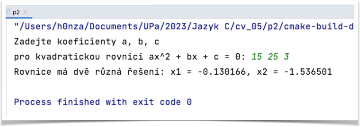

# Příklad 2
## kvadratická rovnice

Napište funkci, která spočítá kořeny kvadratické rovnice. Funkce vrací počty kořenů kvadratické rovnice v oboru reálných čísel, tedy:

* vrací **0** v případě, že rovnice nemá reálné řešení,
* vrací **1** v případě, že rovnice má jedno dvojité řešení (kořen X1 = X2), 
* vrací **2** v případě, že rovnice má 2 různé kořeny.

Hlavní program načte koeficienty `a`, `b`, `c`. Pokud má reálné řešení, pak se výsledky vytisknou na obrazovku. V opačném případě je na obrazovku vytištěno, že reálné řešení nemá.

